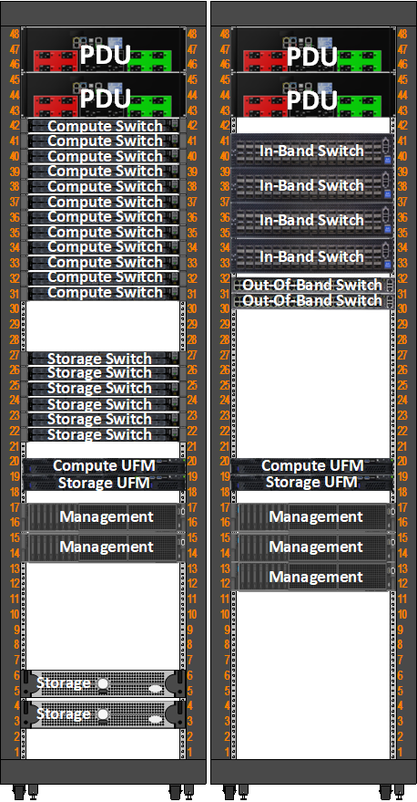
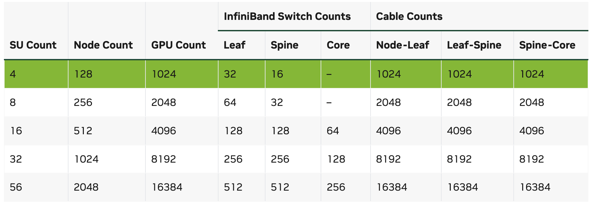
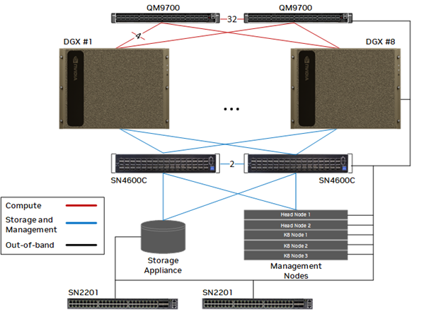

## AIDC智算中心解决方案

我们以NVIDIA DGX系统为标准介绍一下AIDC（智算中心）的解决方案

## AIDC方案

AIDC方案涉及到的层面，包括： 服务器、存储、网络、软件、运维、电力、土建等。

## HGX 模块

以HGX H100为例，是8张H100 SXM + NVLink switch整合在一起的模块，主要提供给超微，联想等OEM厂商

## DGX 服务器

以DGX H100为例，其搭载了8个NVIDIA H100 GPU，每个GPU有80GB显存，总共768GB显存。
硬件配置如下：

| 参数 | 规格 |
|------|------|
| GPU 型号 | 8x NVIDIA H100 Tensor Core GPU |
| GPU 内存 | 8x 80GB HBM3 |
| GPU 互联 | 4代 NVLink™ + NVSwitch™ |
| GPU-to-GPU 带宽 | 900 GB/s |
| 总带宽 | 3.6 TB/s |
| CPU 型号 | 2x AMD EPYC™ 9454P |
| 每颗核心数 | 48 核心 |
| 每颗线程数 | 96 线程 |
| 基础频率 | 2.75 GHz |
| 最大提升频率 | 3.8 GHz |
| 总 L3 缓存 | 384MB |
| 内存容量 | 2TB |
| 内存类型 | DDR5 RDIMM |
| 内存速度 | 4800 MT/s |
| ECC 支持 | 是 |
| 系统存储 | 2x 1.92TB NVMe M.2 SSDs (RAID 1) |
| 数据存储 | 8x 3.84TB NVMe U.2 SSDs (RAID-0, RAID-5, or RAID-6) |
| 总原始存储容量 | 30.72TB NVMe |
| 算力网络 | 8x OSFP-SR8 (400GbE) |
| 存储网络 | 2x QSFP56 (200GbE) |
| 管理网络 | 2x 10GbE |
| 带外接口 | 1x 1GbE BMC |
| 机架单元 | 8U |
| 尺寸（公制） | 897.1mm x 482.2mm x 356mm |
| 尺寸（英制） | 35.3" x 19" x 14" |
| 重量 | 约 130.45 kg (287 lbs) |
| 电源类型 | 4x 4000W 铂金级冗余电源 |
| 输入电压 | 200-240V AC |
| 最大功耗 | 10.2 kW |
| 散热方式 | 直通式风冷 |
| 气流方向 | 前进后出 |
| 工作温度 | 5°C 至 30°C |

## DGX BasePOD

DGX BasePOD的硬件组成包括：

| 组件 | 规格 | 数量 |
|------|------|------|
| DGX 服务器 | DGX H100 | 8 |
| 存储服务器 | DGX Storage Server | 2 |
| BMC管理服务器 | 可选 | 1 |
| 算力网IB交换机 | Mellanox QM9700，400Gx64 | 2 | 
| 带内管理和存储网络RoCE交换机 | 2x Mellanox SN4600C，100Gx64| 2 |
| 带外管理交换机 | Mellanox SN2201，48x RJ45 + 4x QSFP28 100 GbE | 2 |
| 400G线缆| 980-9I13N-00C010 | 32 |
| 400G光模块 | OSFP多模光模块（服务器+交换机侧） | 32x2  |
| 100G有源线缆 | 带光模块线缆 |  |
| DAC铜缆 | infiniband交换机互联 |  | 
| 带外管理网线 | 六类网线 | 45 |

## DGX SuperPOD

DGX SuperPOD是融合了DGX服务器、IB和RoCE网络、管理节点、存储节点的超大规模AI计算集群，典型规模是128-2048台DGX服务器。其机柜一般分为计算机柜和管理机柜。
其单一计算SU rack如下图：

其管理rack如下所示：

管理机架中的compute switch是IB交换机，是算力网交换机，用于连接DGX服务器上的GPU卡。
一个SU中leaf交换机的数量=计算节点数量x8/32，即32台DGX服务器需要8个leaf交换机。
spine交换机数量=计算节点数量x8/32/2，即32台DGX服务器需要4个spine交换机。
因此算力网络使用400G NDR IB交换机12台

SuperPOD典型配置如下所示：

## DGX存储  

AIDC需要高速并行文件存储系统，提供该存储产品的主要厂商，DDN基于Lustre，IBM基于GPFS。

## DGX网络

### 算力网络

节点间Infiniband网络带宽与GPU卡PCIE带宽应相互匹配，H100的总线为PCIe5.0x16，单向带宽为64GB/s，使用Connect-X 7网卡，接口带宽为400Gb/s。A100的总线为PCIe4.0x16，单向带宽为32GB/s，使用Connect-X 6网卡，接口带宽为200Gb/s。

每一台DGX H100服务器，有8个400G算力网络接口。在一个BasePOD中，有2个64口400G算力网络交换机。每台服务器4个网口连接到其中一台交换机。拓扑连接如下图所示：

实际上单一的BasePOD可以使用一台64口交换机实现，但为了未来的扩展，使用了两台交换机，并将上联的32个接口用于交换机互联。

## DGX电源供应

由于AI服务器都是高功耗设备，以DGX H100为例，每台设备高达10kw, NVIDIA官方的机柜宣传是4台DGX服务器在一个机柜中，这是不多见的。一般传统数据中心的机柜供电（一般为3-6kw），无法满足要求。

## 承重

由于AI服务器都是高密度设备，一台DGX H100f服务器高达130kg,一般传统数据中心的机柜承重，无法满足要求。

## 成本

## 参考

[BasePOD 参考架构](https://docs.nvidia.com/dgx-basepod/reference-architecture-infrastructure-foundation-enterprise-ai/latest/reference-architectures.html)
[SuperPOD 参考架构](https://docs.nvidia.com/dgx-superpod/reference-architecture-scalable-infrastructure-h100/latest/dgx-superpod-architecture.html)