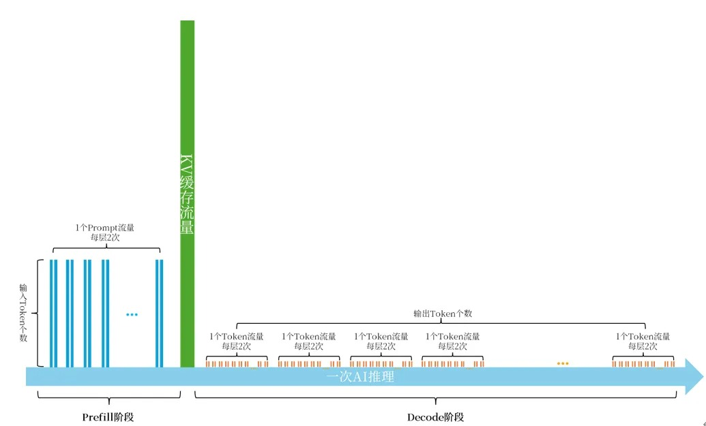

## AIDC智算中心解决方案

AI推理是如何完成一次响应的

## 并行推理

在模型单个GPU能容纳的情况下，数据并行更适合，但在模型单个GPU无法容纳的情况下，则需要张量（Tensor Parallelism）并行。而在多用户并发的情况下，则需要张量TP并行+数据DP并行。同时如果是MoE模型，则需要专家EP并行。

## 分布式推理网络流量计算

推理过程如下图所示：

有如下假设：

L: 模型层数
H: 模型隐藏状态大小
S(in): 输入token数
S(out): 输出token数
U：用户并发数
TP: 张量并行度，指使用的GPU卡数量？？？
DP: 数据并行度
B: 数据格式，float16为2B
G: GPU数量
则有：
一次all-reduce的通信量T(ar) = 2（B数据格式） x H x (Gtp - 1) x Gtp 
在Prefill阶段，有S(in)个tokens，在模型每一层进行2次all-reduce，共 2xS(in)x L 次
在Decode阶段，有S(out)个tokens，在模型每一层进行2次all-reduce，共 2xS(out) x L 次
则有U个用户并发，中间激活值的网络流量为：U x (2xS(in)xL + 2xS(out)xL) x T(ar) = 4 x U x (S(in) + S(out)) x L x H x (Gtp - 1) x Gtp
同时，在一次推理中KV缓存的传递，大小为：4 x S(in) x L x H
则U个用户并发，KV缓存的网络流量为：4 x U x S(in) x L x H

基于以上分析，以Llama3-120B模型为例，模型层数140， 隐藏状态大小8192，张量并行度为4，用户prompt的平均长度S(in)为256个token，产生的输出的平均长度S(out)为4096个token。则要支持100个并发用户请求所需要的推理流量为：
4 x 100 x (256 + 4096) x 140 x 8192 x (4 - 1) x 4 + 4 x 100 x 256 x 140 x 8192 = 22132Gbps + 109Gbps 约为21.7Tbps

假设模型有L层，在一次推理过程中，S(in)个输入token在模型的每一layer进行2次批量合并（NCCL的All-reduce），共2L次，而对于每个输出Token，在模型的每个layer的中均进行2次合并，共 2xS(out) x L 次。此外，在Prefill阶段和Decode阶段之间有一次KV缓存的传递。

## Reference

- [AI智算中心网络-推理篇](https://mp.weixin.qq.com/s/yQn56hh56FE1XDGrrKme7Q)  
- [AI智算中心网络-推理篇2](https://mp.weixin.qq.com/s/ejwQCCfqBrgh4nWYsO6x2w)