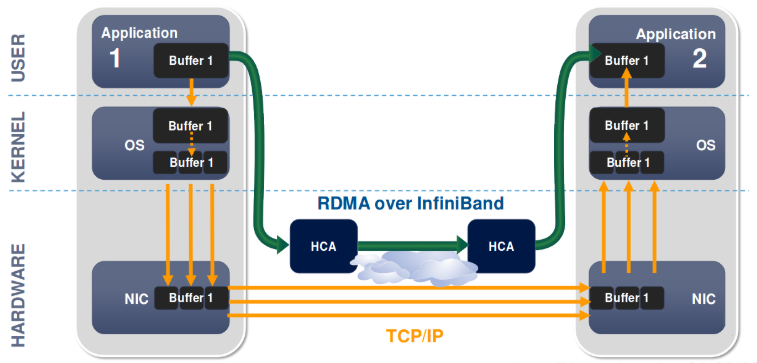
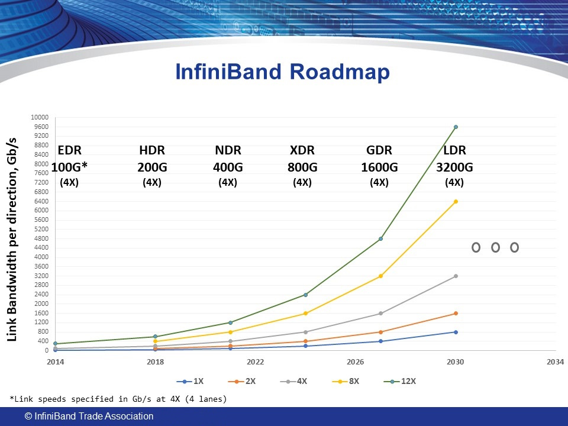

## 什么是RDMA

在介绍RDMA网络之前，我们先来了解下什么是DMA。DMA（Direct Memory Access）是一种允许外部IO设备直接访问内存，而不需要通过CPU的技术。DMA技术可以显著提高数据传输的效率和速度，因为它避免了CPU和Memory之间的数据拷贝，从而减少了CPU的负担，并提高了数据传输的效率。
RDMA（Remote Direct Memory Access）则是允许一台服务器直接访问其他服务器上的Memory。在智算时代，RDMA技术被广泛应用于大规模分布式训练和推理场景中。

## 为什么要使用RDMA

随着AI大模型的快速发展，模型参数量、数据量的不断增加，单个GPU服务器已经难以满足模型训练和推理的算力资源要求，分布式多机多卡的训练与推理已经成为必然。多机多卡的训推场景对算力网络提出了以下要求：

1. 高吞吐量：大模型参数量、数据量巨大，每一次训练推理都是几百G，甚至几十T的数据量；
2. 低延迟：大模型训练推理过程中，数据的传输延迟对训练推理的效率影响很大，当网络延迟成为瓶颈时，会导致GPU空闲等待数据传输完成，从而降低整体的训练效率，进而造成算力的浪费；
3. 高可靠性 ：大模型训练推理过程中，数据的传输可靠性对训练推理的效率影响很大，当网络有丢包重传时，会导致所有GPU闲置，同样造成算力的巨大浪费

传统以太网的设计和实现无法满足以上要求，已经成为大模型训推场景下算力集群的瓶颈。基于RDMA技术的网络从底层技术原理和设计实现上，满足了高吞吐、低延迟、无丢包的要求，从而提升算力了集群的效率。

## RDMA的网络实现

在AI大模型训推场景中使用RMDA技术的网络包括：

- Infiniband简称IB网络；
- RoCE（RDMA over Coveraged Ethernet）网络

### IB网络

IB网络设计为无损网络，在发送端会动态监测接收端的缓存能力，只有在接收端缓存区有足够空间时，才会发送数据。这得益于其完全区别于传统以太网的，自定义的4层网络架构（物理层、链路层、网络层、传输层）。在链路层集成了流控协议，保障发送端速率不会超出接收端的接收速率。传输层中创建的虚拟通道可直接被上层应用使用，不再需要通过操作系统协议栈。

IB网络的主要厂商是已经被英伟达收购的Mellanox公司，其拥有IB网络的核心技术专利，占有全球将近90%的市场份额，是高性能计算集群的首选。IB网络的优势在于超低延迟，高吞吐，交付部署简单，但需要专门的网卡和交换机支持。IB网络的发展路线图如下：

对应英伟达公司的产品线如下：

|网络带宽|交换机产品| 网卡产品 |
|----|----|----|
|200Gbps|Quantum 8700系列交换机| ConnectX-6 系列网卡|
|400Gbps|Quantum-2 9700系列交换机| ConnectX-7 系列网卡|
|800Gbps|Quantum-x800 系列交换机| ConnectX-8 系列网卡|

### RoCE网络

 RoCE同样由IBTA（InfiniBand Trade Association ）制定，通过ECN和PFC实现流量控制，进而实现无损网络。市场上很多网络设备厂商都有提供相应的产品。特点是兼容现有以太网，成本相对较低，交付部署相对复杂。本次暂不做过多介绍。  
 Spectrum是英伟达公司的RoCE网络交换机，其产品线如下：

|网络带宽|交换机产品|
|----|----|
|200Gbps|Spectrum-2 SN3000系列交换机|
|400Gbps|Spectrum-3 SN4000系列交换机|
|800Gbps|Spectrum-4 SN5000系列交换机|

<!-- ## References

[RDMA – Key Technology for Arithmetic Networks](https://www.fibermall.com/blog/rdma-key-technology-for-arithmetic-networks.htm) -->